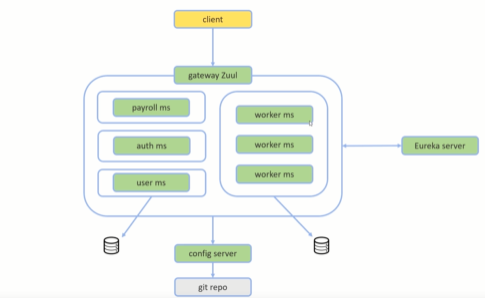

#  Microsserviços Java com Spring Boot e Spring Cloud

Projeto criado durante o curso <a href=“https://www.udemy.com/course/microsservicos-java-spring-cloud/“>Curso Microsserviços Java com Spring Boot e Spring Cloud</a> onde foi possível ter uma introdução a algumas das principais ferramentas do Spring Cloud para estruturação de um sistema em microsserviços, tanto como criar microsserviços escaláveis, com resolução de nomes e balanceamento de carga de forma transparente, usando servidor Eureka.

Tecnologias utilizadas:

 - Feign para requisições de API entre microsserviços
 - Ribbon para balanceamento de carga
 - Servidor Eureka para registro dos microsserviços
 - API Gateway Zuul para roteamento e autorização
 - Hystrix para tolerância a falhas
 - OAuth e JWT para autenticação e autorização
 - Servidor de configuração centralizada com dados em repositório Git
 - Geração de containers Docker para os microsserviços e bases de dados

Link para acesso: https://github.com/joaooliveiraa/ms-course
